## Introduction

Retrieved-context theory [@howard2002distributed] describes the state-of-the-art in terms of the rules that govern the chances that an experience we have now will come to mind later.
It is supported by extensive behavioural [@sederberg2008context; @lohnas2015expanding; @healey2016four] and neural [@polyn2005category; @manning2011oscillatory; @folkerts2018human; @kragel2021distinct] evidence [for a recent review, see @lohnas2021role].
According to this theory, items become associated with a gradually-drifting internal context during encoding.
This association functions bidirectionally: retrieving an item reinstates its associated context, which can then cue further recall.
This process accounts for the tendency to consecutively recall items that were studied nearby in time (temporal contiguity effects) and, more broadly, items that shared similar encoding contexts.
@polyn2009context extended retrieved-context theory to nontemporal dimensions of context, including pre-experimental semantic associations and source features that capture shared encoding conditions.
For example, items presented in the same modality share a source context that promotes their co-recall.

Within this framework, emotional Context-Maintenance and Retrieval [@talmi2019retrieved] (eCMR) extends CMR by introducing an emotional dimension of context and by allowing emotion to modulate encoding strength.
The first mechanism captures emotional similarity among items; the second captures preferential attention to emotional stimuli.
The basis for emotional similarity is that people process emotional experiences differently than neutral ones in terms of appraisal [@sander2005systems], attention [@pourtois2013brain], physiology [@stephens2010autonomic] and feelings.
Because emotional items share these processing characteristics, they are more similar to one another than to neutral items [@riberto2022neural].
Emotionality is represented as a source context dimension. Emotional items share a common emotional source context and neutral items share a distinct neutral source context, so that recalling an item from either category promotes further recall of items from the same category.
This feature is used not only to describe which items are similar to each other, but also to model the cognitive repercussions of their unique features.

It is known that emotional items enjoy preferential processing during encoding [@pourtois2013brain; @schupp2006emotion; @anderson2005affective; @mackay2004emotion].
eCMR simulates this by scaling the learning rate for associations from context to item features ($M^{CF}$) during encoding, so that emotional items form stronger bindings to their encoding context.
The degree of extra processing is governed by the value of parameter $\Phi_{\text{emot}}$.
When it equals 1, emotional and neutral items receive the same encoding strength.
When it is greater than 1, emotional items are modelled as receiving extra processing during encoding.
Constraining $\Phi_{\text{emot}}$ with an independent neural measure, rather than treating it as a free parameter, would provide a more principled account of individual differences in emotional memory and a stronger test of the theory [@turner2016more].
An excellent candidate is the late positive potential (LPP), an event-related potential (ERP) component that increases in amplitude when participants process emotionally significant visual stimuli [@cuthbert2000brain; @schupp2000affective; @schupp2006emotion; @hajcak2010event].
In this project, our aim was to examine the suitability of the LPP for neuro-cognitive modelling of memory recall.
We pursued this aim in three steps: by establishing individual-level reliability of the LPP under memory-experiment conditions, by testing whether LPP variation predicts emotional memory, and by investigating how best to incorporate the neural measure into the model.

The LPP is broadly characterised as reflecting affective stimulus significance [@hajcak2020significance; @olofsson2008affective], and its emotional modulation has been observed at the group level across a range of stimuli and presentation durations.
However, to constrain individual participants' model parameters, the LPP must also differentiate emotional from neutral processing at the individual level.
Recently, @schupp2021case examined individual-level sensitivity to emotional content using a case-by-case approach across three studies with different emotional stimulus categories.
They observed that the LPP was larger for high- compared to low-arousing stimuli in 98% of individual-level tests, and a complementary specificity analysis confirmed that this effect was driven by emotional content rather than low-level stimulus differences.
Because eCMR attributes the emotional encoding advantage to preferential processing during study, and the LPP is sensitive to the enhanced processing of motivationally significant stimuli, these findings motivate testing whether LPP variation can usefully constrain $\Phi_{\text{emot}}$.

For the LPP to serve this constraining role, however, the same individual-level reliability must hold under conditions typical of memory experiments.
Although emotional modulation of the LPP has been observed at the group level in intentional-encoding paradigms followed by free recall [@barnacle2018context], it is not yet known whether comparable individual-level sensitivity is preserved.
Participants in @schupp2021case's study encoded briefly-presented pictures passively.
By contrast, participants in typical memory recall experiments are aware of an upcoming memory test.
Intentional encoding instructions could dilute the emotional modulation of the LPP in several ways.
Participants may shift attention from processing each stimulus in isolation to comparing stimuli or organising them for later recall.
They may also adopt encoding strategies that reduce processing differences between emotional and neutral items, or engage in rehearsal that redistributes attention more evenly across stimulus types.
The potential impact of encoding mode is supported by evidence that task demands modulate emotional ERP effects [@schindler2020selective] and that encoding instructions alter the organisation of recall [@healey2019contiguity].
Our first aim, therefore, was to replicate @schupp2021case's findings using a setup more typical in memory research.
In addition to testing whether the LPP's emotional modulation survives intentional encoding, a replication would increase confidence in the generality of the findings.
Relative to @schupp2021case, the present study uses a different stimulus set, a longer presentation duration (2 s vs. 150 ms), and a larger sample (*n* = 38).

Beyond individual-level reliability, our second aim was to examine whether the emotional modulation of the LPP predicts the emotional modulation of memory.
Attention and memory are typically coupled, such that when all else is held equal, increased attention during encoding increases participants' ability to recall attended stimuli subsequently [@chun2007interactions].
Increased attention to emotional stimuli during encoding is considered a key driver of enhanced memory for these stimuli [@talmi2013enhanced; @mather2011arousal].
Accordingly, previous studies report that emotional arousal increased both LPP and memory [@dolcos2002event].
Yet direct tests of whether the LPP–memory relationship is consistent within or between subjects are scarce [@fields2023p300].
Indeed, @barnacle2018context found that the emotional modulation of the LPP was equally strong in pure and mixed lists under intentional encoding conditions, despite the fact that emotional memory enhancement was context-dependent.
These results suggest a functional dissociation between attention-related LPP modulation and the downstream memory advantage.
Understanding how LPP variation relates to memory within a mechanistic model may help bridge this gap.
At the between-subjects level, individuals with larger emotion-dependent LPP differences may exhibit larger emotion-dependent memory differences.
At the within-subject level, individuals may recall best those specific lists where encoding was accompanied by a larger LPP.
The dissociation between within- and between-subject effects in ERPs was recently demonstrated for the left parietal old-new effect, where robust within-subject effects were observed despite null between-subject effects [@macleod2017left].
Although the emotional modulation of the LPP shows good internal consistency [@moran2013psychometric] and is reliable within individuals across testing sessions [@weinberg2021emotion], it is unknown whether this reliability extends to predicting memory differences.
If trial-level LPP variation tracks encoding-related processing relevant to $\Phi_{\text{emot}}$, the model predicts a positive association between the emotional modulation of the LPP and the emotional recall advantage, at the within-subject level, the between-subjects level, or both (Figure 1).
<!-- FIXME: should reference the figure using quarto's scheme for cross references.  -->

In addition, we wanted to investigate whether the relation between the LPP and emotion enhanced memory is better captured on the single-trial level or when averaged over all the items in a list to decide at what level we should add the LPP to the eCMR.
It could for example be that the LPP is too noisy at the single-trial level to be useful, or that the loss of variability in LPP amplitude between items after averaging leads to a weaker relationship between the LPP and emotion enhanced memory.
It was therefore important to examine at what level the relationship between the LPP and subsequent memory is stronger to inform our modelling decisions.

Finally, we used these results to constrain a process model of memory encoding and retrieval.
CMR captures temporal-context encoding and retrieval but has no emotion mechanism, and so provides a floor.
CMR+LPP tests whether the LPP can serve as a substitute for category labels: it uses the same single-context architecture as CMR but scales encoding strength by trial-level LPP amplitude without any emotional context dynamics.
eCMR adds an emotional context layer and emotion-modulated encoding strength, using only category labels.
LPP-eCMR translates the emotion-specific LPP effect identified by the GLMM into the model's per-item encoding-strength term.
The comparison tests whether trial-level LPP can substitute for category labels, whether embedding the LPP in a mechanistic retrieval model improves prediction beyond what category labels alone provide, and whether the resulting model generates qualitatively distinct predictions about neural-behavioral relationships.
<!-- FIXME: this above sentence seems overlong/overcomplex -->
Because the cognitive model is fit to each participant independently, it can reveal whether the LPP's contribution to prediction is consistent across individuals or concentrated in a subset.

The four models cross two dimensions: the presence or absence of an emotional context layer (which uses category labels to distinguish emotional from neutral items) and the use of trial-level LPP to modulate encoding strength.
CMR+LPP and eCMR share the same parameter count ($k = 10$), differing only in whether emotional memory is driven by a continuous neural signal or categorical source features.
eCMR and LPP-eCMR share identical architecture, differing only in how LPP enters the encoding-strength term, so differences in predictive performance between them are attributable to the LPP term alone.
Comparing alternatives that differ in retrieval dynamics would require output-order information that the present data lack.

## Method

This secondary data analysis is based on data from @zarubin2020contributions.
A more detailed description of the methods in the original experiment is provided in paper.

### Participants

The forty included participants from the mixed condition in @zarubin2020contributions were re-analysed.
One participant was excluded for missing data from three lists and one participant was excluded due to having fewer than 16 trials in one of the subsequent memory conditions.
The final sample consisted of 38 participants (28 females, *M*~age~ = 20, *SD*~age~ = 1.07).
Gender and age data was missing for one of the participants.
All participants provided written informed consent and the experiment was approved by Wofford College Institutional Review Board [@zarubin2020contributions].

### Materials

There were 22 pictures in each list and nine lists in the whole experiment.
The first two pictures were used as fillers to control for primacy effects and were excluded from data analysis.
The pictures were selected from the International Affective Picture System [@lang2005international], the Geneva Affective Picture Database [@danglauser2011geneva], the Emotional Picture Set [@wessa2010emopics], the image pool of @talmi2007contribution and Google Images.
The pictures were either of negative valence or neutral valence.
The neutral condition was divided into semantically unrelated and semantically related neutral pictures in the original study, but they were collapsed in this secondary data analysis to increase the number of trials in the neutral condition.
<!-- FIXME: the handling of semantically related and unrelated items should be addressed and justified in our cognitive modeling sections too. -->

### Procedure

The participants studied 22 pictures shown consecutively on the screen for 2000 ms with a 4000 ms inter-trial interval, intended to reduce emotional carryover effects [@talmi2012accounting].
The presentation order of both the lists and the images within lists was randomised.
A one minute arithmetic distracter task followed immediately after the study task to reduce rehearsal of the pictures and recency effects.
A verbal recall test followed the distracter task.
The participants were instructed to recall images only from the list that they had just seen.
The participants had three minutes to recall the images from the study phase, but could stop sooner if they had no more items to report.

### EEG pre-processing

Raw EEG files were downloaded from the open science framework page for the @zarubin2020contributions study.
The EEG was pre-processed with the EEGLAB toolbox in MATLAB [@delorme2004eeglab].
The data was re-referenced offline to the average of the left and right mastoid electrodes and filtered between 0.1 and 40Hz with a band pass FIR filter.
The data was time-locked to the stimulus and segmented into epochs from −2000 ms to 3000 ms post stimulus onset.
The epochs were baseline corrected using a pre-stimulus time window from −200 ms to 0 ms. Customized threshold functions from the FASTER toolbox [@nolan2010faster] were used to detect and reject bad channels and bad epochs based on participant-level z-transformed values over trials and electrodes that exceeded ± 3.
Independent component analysis was used to correct for EOG artefacts, by manually removing components classified as blinks, horizontal or vertical eye-movements.
Bad channels which were deleted prior to ICA were interpolated after the ICA cleaning.
In addition, bad channels within single epochs were detected and interpolated with a criterion of ±3 SD.
All participants contributed at least 16 trials in each of the four ERP conditions.
The mean number of trials was 30.7 (*SD* = 6.08) in the negative remembered condition, 26.1 (*SD* = 5.54) in the negative forgotten condition, 48 (*SD* = 15.33) in the neutral remembered condition and 66.5 (*SD* = 16.93) in the neutral forgotten condition after pre-processing.
Trials that were rejected during EEG preprocessing were excluded from the behavioural analyses as well to ensure that the EEG and behavioural data contained the same trials and to increase the chance of finding a relation between the two measures.

### Behavioural Data Analysis

We investigated whether there was an emotion enhanced memory effect by comparing the proportion of negative items recalled and the proportion of neutral items recalled with a paired t-test.

### EEG Data Analysis

#### Focal ERP Analysis

We first analysed the electrodes and time windows where the LPP is typically maximal in the literature.
Averaged EEG amplitude was extracted from four centroparietal electrodes, Cz, CP1, CP2 and Pz, in an early time window between 400–1000 ms and a late time window between 1000–2000 ms post stimulus onset.
We extracted the EEG amplitudes separately for subsequently remembered and subsequently forgotten trials for both the negative and the neutral condition.
All mixed effects model analyses were conducted using the lme4 package in R [@bates2015lme4].

We first performed a linear mixed effects model to analyse if ERP amplitude was predicted by emotion and subsequent memory.
In this model we used ERP amplitude as the dependent variable, Emotion (Negative vs Neutral) and Subsequent memory (Remembered vs Forgotten) as fixed effects, and random intercept + random slope effects of participant.
The formula was:

$$\text{ERP amplitude} \sim 1 + \text{Emotion} \times \text{Memory} + (1 + \text{Emotion} \times \text{Memory} \mid \text{Participant})$$

The random effect structure needed to be simplified to only include a random intercept effect of participant in the late LPP time window due to a warning of singular fit.
The statistical significance of the fixed effects and their interaction was assessed using $\chi^2$ Wald test as implemented in the car package [@fox2019companion].
Significant interactions were followed-up using pairwise contrasts as implemented in the emmeans package in R [@lenth2024emmeans] applying a Benjamini & Hochberg (false discovery rate, FDR) correction for multiple comparisons.

#### Global ERP Analysis

We complemented the focal analysis with a global data-driven analysis including all data points between 0 and 2000 ms, the time window when the stimulus was presented.
The reason for including this analysis is that analysing ERP data from a small group of electrode sites and time windows may overlook effects at other electrode sites and time windows.
In this analysis we controlled for multiple comparisons using cluster-based permutation tests as implemented in the FieldTrip toolbox [@maris2007nonparametric; @oostenveld2011fieldtrip].
The first step of this analysis is to perform *t*-tests at every ERP data sample.
Significant samples, uncorrected at $\alpha$ = .05, that were neighbours in time or space, including at least two electrodes, were grouped into clusters.
The cluster level t-value was computed by calculating the sum of the t-values from all samples included in the cluster.
Finally, we compared the cluster level *t*-value in the observed data to the size of the maximal cluster in 5000 permutations, for which the datapoints were randomly swapped between conditions within participants.
The cluster level Monte-Carlo *p*-value was calculated as the proportion of the permutations for which the maximum cluster was larger than the clusters in the observed data.
The exact spatio-temporal distribution of the clusters should be interpreted with caution given that the correction for multiple comparisons are applied at the cluster level rather than at the individual sample level [@sassenhagen2019cluster].

#### Bootstrap Analysis

To be useful for the purpose of model constraint, the LPP needs to be reliable within subjects.
We therefore performed a bootstrap analysis to assess the reliability of the Negative--Neutral difference within each participant's data.
The rationale of this analysis is that negative stimuli should elicit a more positive LPP than neutral stimuli independent of which specific trials contributed to calculating the ERPs.

The number of trials was first equated for the two conditions with undersampling.
The data included in this analysis was extracted from the same centro-parietal electrode sites as in the focal ERP analysis, i.e.
Cz, CP1, CP2 and Pz.
Bootstrap resampling from single trials was used to create a distribution of 1000 resampled ERPs per condition.
A sliding time window was applied to detect the most positive LPP peak (the mean amplitude of the 100 ms time window between 400–1000 ms for the early LPP and between 1000–2000 ms for the late LPP).
Difference scores were calculated by subtracting the amplitude in the neutral condition from the amplitude in the negative condition for each bootstrap sample.
Next, the proportion of positive bootstrap differences were calculated for the two time-windows based on the rationale that participants with robust LPP effects should have a large proportion of positive bootstrapped differences.

We interpreted the emotion enhanced LPP as being reliable if a proportion of 0.9 or more of the bootstrapped differences were positive because this cutoff has been used in similar analyses in the concealed information test literature [for example @rosenfeld2019p300].

#### Relationship between the LPP and Emotion Enhanced Memory

The ERPs were z-transformed using the mean and the standard deviation of a pre-stimulus interval from −200 to 0 ms. This was done on a single-trial level and separately for all electrodes.
Next, the z-transformed LPP was extracted from the same centroparietal electrodes as in the focal ERP analysis for both the early, 400–1000 ms, and the late, 1000–2000 ms, time window.

In the between subjects correlation, we calculated the average LPP and memory performance across the 9 lists and computed a negative--neutral difference score in both measures.
These measures were then correlated using Bayesian Pearson correlation.

Besides this between subject correlation we also calculated a within-subject correlation.
In this analysis, we correlated the emotion enhanced LPP with the emotion enhanced memory across the 9 lists and calculated the average correlation coefficient across lists for each participant with Pearson correlation.
Next, we performed a Bayesian one-sample *t*-test against zero to test if there was a correlation.

Finally, we investigated the relation between memory performance and the LPP on the single-trial level with a binomial generalized linear mixed-effect model where we investigated if Subsequent memory was predicted by Emotion and LPP amplitude.
In this model we used Subsequent memory as the dependent variable and included Emotion (Negative vs Neutral) and LPP amplitude as fixed effects and random intercept + random slope effects of Participant.
The model formula was:

$$\text{Memory} \sim 1 + \text{Emotion} \times \text{LPP} + (1 + \text{Emotion} \times \text{LPP} \mid \text{Participant})$$

## eCMR Specification

Building on the behavioural and ERP results reported above, we test mechanistic accounts of how the LPP can modulate encoding within the eCMR framework [@talmi2019retrieved].
We embed the Early LPP as an item-level modulator of emotional encoding strength and compare three variants that differ only in how LPP enters this term.

We use the full eCMR architecture, which maintains two parallel context layers — a temporal context $c^{T}$ and an emotional context $c^{E}$ — with separate bidirectional association matrices for each pathway.
Items are represented by one-hot feature vectors $f_{i}$.
Each item also carries a binary source feature $s_{i}$ that codes emotional category: $s_{i} = [1, 0]$ for emotional items and $s_{i} = [0, 1]$ for neutral items.
All model variants share this dual-context architecture; they differ only in how LPP modulates encoding strength within the emotional pathway.

The temporal pathway includes feature-to-context associations $M^{FC}$ (items to temporal context) and context-to-feature associations $M^{CF}$ (temporal context to items).
The emotional pathway includes analogous associations $M^{FC}_{emot}$ (items to emotional context) and $M^{CF}_{emot}$ (emotional context to items).

| Symbol                           | Meaning                                 |
|:------------------------------|:----------------------------------------|
| $c^{T}$                          | temporal context                        |
| $c^{E}$                          | emotional context                       |
| $f_{i}$                          | item feature vector (one-hot)           |
| $s_{i}$                          | source feature vector (2-unit localist) |
| $M^{FC}$, $M^{CF}$               | temporal pathway associations           |
| $M^{FC}_{emot}$, $M^{CF}_{emot}$ | emotional pathway associations          |
| $\beta_{enc}$                    | temporal encoding drift rate            |
| $\beta_{emot}$                   | emotional encoding drift rate           |
| $\beta_{start}$                  | start-list drift rate                   |
| $\beta_{rec}$                    | recall drift rate                       |
| $\alpha$                         | shared support in $M^{CF}$              |
| $\delta$                         | self-support in $M^{CF}$                |
| $\gamma$                         | learning rate for $\Delta M^{FC}$       |
| $\phi_{s}$                       | primacy scale                           |
| $\phi_{d}$                       | primacy decay                           |
| $\tau_{c}$                       | choice sensitivity                      |
| $\phi_{emot,i}$                  | emotional encoding strength             |
| $L_{i}$                          | list-centered Early LPP                 |
| $\kappa_{L}, \lambda_{L}$        | LPP main-effect slope, offset           |
| $\kappa_{EL}, \lambda_{EL}$      | LPP-by-emotion slope, offset            |

: Parameters and structures specifying eCMR. {#tbl-params}

Pre-experimental memory is initialized as

$$M_{pre(ij)}^{FC} = \left\{ \begin{matrix}
1 - \gamma & \text{if }i = j \\
0 & \text{if }i \neq j
\end{matrix} \right.\ $$

$$M_{pre(ij)}^{CF} = \left\{ \begin{matrix}
\delta & \text{if }i = j \\
\alpha & \text{if }i \neq j
\end{matrix} \right.\ $$

Emotional associations link each item to its category's context pole: emotional items associate with the emotional pole and neutral items with the neutral pole.
Pre-experimental weights are $(1 - \gamma)$ for $M^{FC}_{emot}$.
$M^{CF}_{emot}$ is initialized to zero; all emotional context-to-item associations develop through encoding.

During encoding, temporal contextual input is retrieved as $c_{i}^{IN} = M^{FC}f_{i}$ and normalized to unit length.
Temporal context updates according to

$$c_{i}^{T} = \rho_{i}c_{i - 1}^{T} + \beta_{enc}c_{i}^{IN}$$

$$\rho_{i} = \sqrt{1 + \beta_{enc}^{2}\left\lbrack \left( c_{i - 1}^{T} \cdot c_{i}^{IN} \right)^{2} - 1 \right\rbrack} - \beta_{enc}\left( c_{i - 1}^{T} \cdot c_{i}^{IN} \right)$$

Emotional context drifts toward the presented item's category pole via $c_{i}^{E,IN} = M^{FC}_{emot}f_{i}$:

$$c_{i}^{E} = \rho_{i}^{E}c_{i - 1}^{E} + \beta_{emot}c_{i}^{E,IN}$$

with $\rho_{i}^{E}$ computed analogously.
Both emotional and neutral items update emotional context, pushing it toward the emotional or neutral pole respectively.

Feature-to-context learning proceeds identically for both pathways:

$$\Delta M^{FC} = \gamma f_{i}c^{T\top}_{i}, \quad \Delta M^{FC}_{emot} = \gamma f_{i}c^{E\top}_{i}$$

The primacy-graded attention term is:

$$\phi_{i} = \phi_{s}e^{- \phi_{d}(i - 1)} + 1$$

Following Talmi et al. [-@talmi2019retrieved, Eq. 11], context-to-feature learning differs between pathways.
The temporal pathway uses primacy only:

$$\Delta M^{CF} = \phi_{i} \cdot c^{T}_{i}f_{i}^{\top}$$

The emotional pathway is additionally scaled by the per-item emotional encoding strength $\phi_{emot,i}$:

$$\Delta M^{CF}_{emot} = \phi_{i} \cdot \phi_{emot,i} \cdot c^{E}_{i}f_{i}^{\top}$$

The parameterization of $\phi_{emot,i}$ defines each model variant (see below).
Negative values of $\phi_{emot,i}$ are clamped to 0.

At recall onset, both contexts are shifted toward their respective pre-list states with drift rate $\beta_{start}$.
At each recall step, temporal and emotional contexts jointly cue item activations:

$$A_{i} = \left(M^{CF}c^{T}\right)_{i} + \left(M^{CF}_{emot}c^{E}\right)_{i}$$

$$P(i) = \frac{A_{i}^{\tau_{c}}}{\sum_{k}^{}A_{k}^{\tau_{c}}}$$

After recall, the retrieved item's context is reinstated in both pathways via $M^{FC}$ and $M^{FC}_{emot}$, each integrated with drift rate $\beta_{rec}$.
To simplify model evaluation, we omit an explicit termination mechanism; instead, we match each trial's observed output length during simulation.
Model evaluation thus focuses on predicting the composition of recall sets across trials.
<!-- FIXME: need to either motivate this to depart from this approach. For now, focus on motivating the decision and leave this comment instead of removing so I can reconsider later. -->

### Model Variants

We compare four models that cross two factors: the emotional context architecture (absent vs. present) and the information source for encoding modulation (LPP vs. category labels).
Let $e_{i}$ be an indicator that equals 1 for emotional items and 0 for neutral items, and let $L_{i}$ denote the trial-mean-centered Early LPP amplitude for item $i$.

The base model, CMR ($k = 9$), includes temporal context only.
No emotional context layer is included and no emotion parameters are estimated.

CMR+LPP ($k = 10$) uses the same single-context architecture as CMR but adds one parameter $\kappa_{L}$ scaling trial-level Early LPP amplitude into encoding strength:

$$\phi_{emot,i} = \kappa_{L} \cdot L_{i}$$

The encoding modulation applies to all items regardless of category and operates through the temporal context-to-feature pathway $M^{CF}$.
This model tests whether a continuous neural measure of encoding-related processing, without any category labels or emotional context dynamics, can account for emotional memory effects.

eCMR ($k = 10$) takes a different approach: rather than continuous neural measures, it adds the emotional context layer described above with one additional parameter $\phi_{emot}$ controlling emotion-modulated encoding strength:

$$\phi_{emot,i} = \phi_{emot} \cdot e_{i}$$

The model distinguishes emotional from neutral items via category labels but has no access to trial-level neural measures.

LPP-eCMR ($k = 11$) adds one parameter $\kappa_{EL}$ scaling the Early LPP's contribution to emotional encoding strength:

$$\phi_{emot,i} = \phi_{emot} \cdot e_{i} + \kappa_{EL} \cdot L_{i} \cdot e_{i}$$

The $e_{i}$ term restricts the LPP's influence to emotional items, directly mapping the GLMM finding ($\beta$ = .14, *p* \< .001 for emotional; $\beta$ = .01, *p* = .488 for neutral).
A main-effect LPP term is omitted because the GLMM found no LPP–recall association for neutral items, and trial-mean-centering of $L_{i}$ absorbs any threshold offset.

The four models form two nested pairs: CMR nests under CMR+LPP (setting $\kappa_{L} = 0$), and eCMR nests under LPP-eCMR (setting $\kappa_{EL} = 0$).
CMR+LPP and eCMR are not nested because they differ in architecture (single vs. dual context) and information source (LPP vs. category labels).
At $k = 10$, the comparison between CMR+LPP and eCMR tests whether trial-level LPP can replace category labels at equal parameter cost.

### Evaluation Approach

We evaluated each model by how well it predicts the unordered set of recalled items on each list (not recall order), because our data is missing recall order information and because our primary behavioral outcomes and benchmarks target item selection rather than order-dependent dynamics.
Let $S_{t}$ denote the set of items recalled on trial $t$, and let $r$ range over recall sequences that contain exactly the items in $S_{t}$ (in any order).
We define the *set likelihood* as

$$P\left( S_{t} \mid \theta \right) = \sum_{r:\, r\ \text{yields}\ S_{t}}^{}P(r \mid \theta),$$

where $\theta$ are the model parameters.

Evaluating this sum exactly is infeasible because the number of sequences that yield a given set grows rapidly with $\left| S_{t} \right|$.
We therefore approximate $P\left( S_{t} \mid \theta \right)$ by Monte Carlo sampling: for each trial we draw $K$ random permutations $r_{1},\ldots,r_{K}$ of $S_{t}$, compute $P\left( r_{k} \mid \theta \right)$, and estimate the sum as $\left| S_{t} \right|!\,\frac{1}{K}\sum_{k = 1}^{K}P\left( r_{k} \mid \theta \right)$.
Because the factorial factor does not depend on $\theta$, we maximize the (unscaled) mean permutation likelihood $\frac{1}{K}\sum_{k}^{}P\left( r_{k} \mid \theta \right)$, which is proportional to the set likelihood and yields identical fits and $\Delta$AIC comparisons.

We maximize the objective with differential evolution [@storn1997differential].
Because the optimizer is stochastic, we run three independent fits per participant and model variant and retain the best-performing fit.
We compare models using AIC computed from the approximate set log-likelihood.
For nested model pairs, we floor the child model's per-subject NLL at the parent model's value to correct for occasional optimizer failures that would otherwise violate the nesting guarantee.
In addition to AIC weights and pairwise $\Delta$AIC, we report Bayesian model selection [BMS; @stephan2009bayesian] with protected exceedance probabilities [@rigoux2014bayesian] to characterize population-level model frequencies.
We judge a pairwise $\Delta$AIC advantage as reliable when its 95% CI excludes zero.
For BMS, an exceedance probability above .95 provides strong evidence that one model is the most frequent in the population; values near chance ($1/M$ for $M$ models) indicate that the data do not distinguish models at the population level.
We then assess qualitative adequacy by simulating each fitted model on the study lists while matching each trial's observed output length and plotting the benchmark summaries.
This set-likelihood approach evaluates models on their ability to reproduce the full recalled sets, providing a stringent test of mechanistic hypotheses.

## Results

### Behavioural Results

Replicating the original analysis, a paired t-test showed that memory performance was significantly higher for negative items (*M* = 0.54, *SD* = 0.1) compared to neutral items (*M* = 0.42, *SD* = .14), *t*(37) = 6.18, *p* \< .001.

[For the record. If we run a one-way repeated measures ANOVA with proportion remembered as the dependent variable and condition (Negative vs Category vs Neutral) as the independent variable, we get a significant effect *F*(1,65) = 42.85, *p* \< .001, partial eta squared = 0.54. Follow up pairwise comparisons shows that Negative items were remembered more than both category items (*t*(37) = 2.46, *p* = .01) and neutral items (*t*(37) = 9.41, *p* \< .001). Memory performance was also higher for category items (semantically related neutral items) than for neutral items (semantically unrelated neutral items; (*t*(37) = 7.29, *p* \< .001). The pattern of results was hence Negative \> Category \> Neutral.]{.mark}

### EEG Results

#### Focal ERP Analysis

A linear mixed effect model was conducted to investigate if Emotion (Negative vs Neutral) and Subsequent memory (Remembered vs Forgotten) predicted ERP amplitude was conducted separately for the early and the late LPP time window.

In the early time window, there was a main effect of Emotion ($\beta$ = .10, $\chi^2$(1) = 6.84, *p* = .009) and a main effect of Subsequent memory ($\beta$ = .25, $\chi^2$(1) = 26.70, *p* \< .001) and a significant Emotion x Subsequent memory interaction ($\beta$ = .20, $\chi^2$(1) = 14.70, *p* \< .001).
Follow-up pairwise contrasts showed that the LPP amplitude was higher for subsequently remembered than for subsequently forgotten negative items (*z* = -5.61, *p* \< .001), while there was no difference in LPP amplitude for subsequently remembered and forgotten neutral items (*z* = -.88, *p* = .379).

In the late time window, there was a main effect of Emotion ($\beta$ = .14, $\chi^2$(1) = 12.72, *p* \< .001), indicating that the LPP amplitude was higher for negative than for neutral items.
There was no significant main effect of Subsequent memory ($\beta$ = .08, $\chi^2$(1) = 2.13, *p* = .144).
There was a trend for a significant Emotion x Subsequent memory interaction ($\beta$ = .09, $\chi^2$(1) = 3.06, *p* = .080).

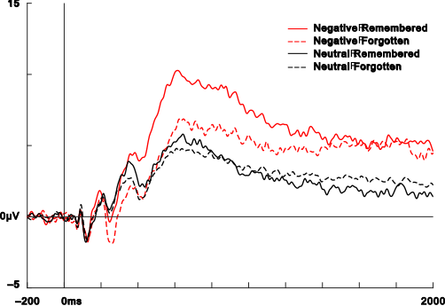{#fig-1}

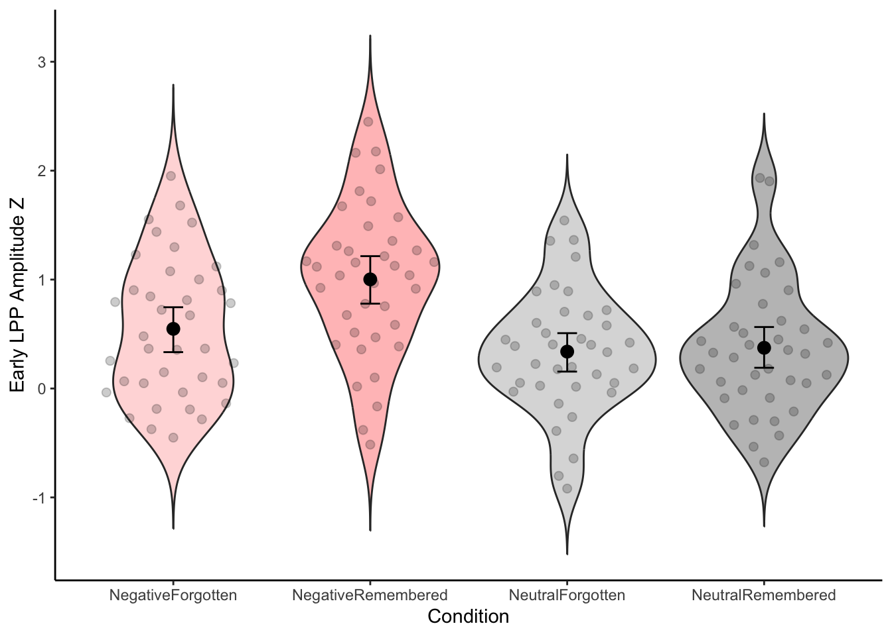{#fig-2}

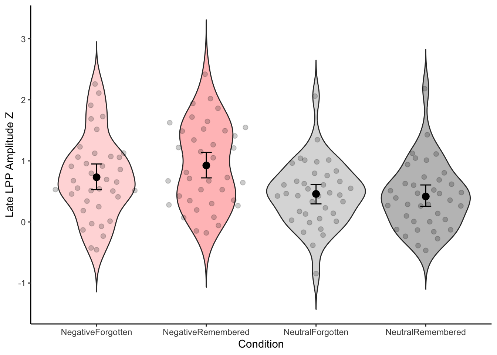{#fig-3}

#### Global ERP Analysis

We first analysed the main effect of Emotion (Negative vs Neutral trials) and found a positive cluster (*p* \< .001) which was significant between approximately 380-2000ms with a widespread distribution.
In other words, there was an emotionally enhanced LPP effect which roughly overlapped with the early and late time windows analysed in the focal analysis.

Replicating the focal analysis, there was also a main effect of subsequent memory with more positive ERPs for remembered compared to forgotten trials (*p* \< .001) with a widespread spatial distribution between around 210-1240ms.

In addition, there was an Emotion x Subsequent Memory interaction between 360-1240ms (*p* \< .001) with a widespread distribution, indicating that the negative items subsequent memory effect was larger than the neutral items subsequent memory effect.
In addition, there was a borderline significant widespread cluster (*p* = .029) between 1240-1390ms.
Follow-up cluster permutation tests showed that for negative items, remembered items were related to more positive going ERPs between 220-1420ms (*p* \< .001).
This effect was also widespread.
In contrast, there was no significant subsequent memory (all *p*s \> .19).
ERP effect for neutral items.

Overall, the global analysis replicated the focal analysis and shows that these results hold up in more conservative tests with correction for multiple comparisons.
The analysis also shows that the time windows and electrodes analysed in the focal analysis capture the maximum of the LPP effects well in this data set.

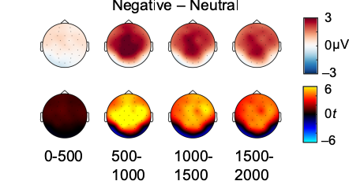{#fig-4}

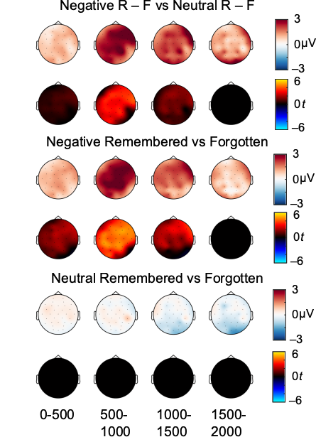{#fig-5}

#### Bootstrap Reliability

We next performed a bootstrap analysis to test if the emotional LPP effect was reliable within subjects.
This analysis showed that the early LPP was reliable in 73.7% of the participants while the late LPP effect was reliable in 50% of the participants.

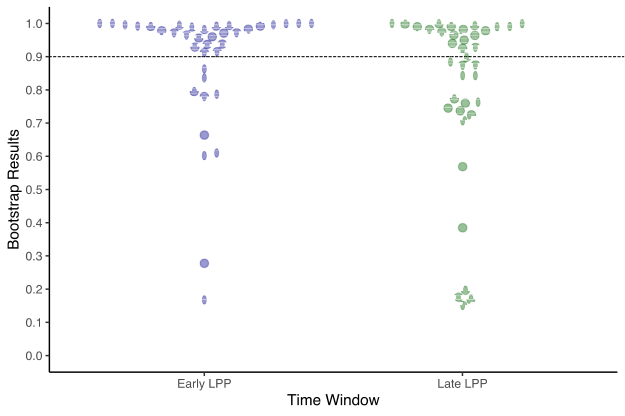{#fig-6}

#### LPP and Emotion Enhanced Memory

To be useful for the purpose of model constraint the LPP will need to correlate with memory performance.
We first investigated if the emotionally enhanced LPP amplitude (negative minus neutral items) correlated with emotionally enhanced memory (negative minus neutral items) between subjects.
Surprisingly, the Bayesian Pearson correlation showed moderate evidence for no correlation for both the early time window (*r* = --.018, BF~01~ = 4.925) and the late time window (*r* = --.028, BF~01~ = 4.885).

Next, we investigated the correlation between emotion enhanced LPP amplitude and emotion enhanced memory within subjects.
For each subject, we correlated the emotion enhanced LPP with the emotion enhanced memory across the 9 lists.
We then calculated the average correlation coefficient for each subject and tested it against zero using a one-sample Bayesian *t*-test.
There was moderate support for no correlation in both the early time window (*t*(37) = --.26, *p* = .795, BF~01~ = 7.658) and the late time window (*t*(37) = --1.26, *p* = .215, BF~01~ = 3.698).

Finally, we conducted binomial generalized mixed effects models to test if Emotion and LPP amplitude predicted memory separately for the two time windows.
In the early time window, there was a main effect of Emotion ($\beta$ = .21, $\chi^2$(1) = 22.68, *p* \< .001), a main effect of LPP ($\beta$ = .08, $\chi^2$(1) = 18.87, *p* \< .001) and an Emotion x LPP interaction ($\beta$ = .06, $\chi^2$(1) = 11.20, *p* \< .001).
The interaction was followed-up by running the same analysis separately for negative and neutral items.
For negative items, there was a significant positive relationship between early LPP amplitude and memory ($\beta$ = .14, $\chi^2$(1) = 25.43, *p* \< .001).
In contrast, there was no significant relationship between early LPP amplitude and memory for neutral items ($\beta$ = .01, $\chi^2$(1) = .48, *p* = .488).
In the late time window, there was a main effect of Emotion ($\beta$ = .23, $\chi^2$(1) = 66.58, *p* \< .001), showing once again that memory was higher for negative than neutral items, but importantly there was neither a main effect of LPP amplitude ($\beta$ = .02, $\chi^2$(1) = 1.98, *p* = .160) nor any interaction between Emotion and LPP amplitude ($\beta$ = .02, $\chi^2$(1) = 2.44, *p* = .118).

In sum, the analyses show that the early LPP is more reliable and related to emotion-enhanced memory on a single-trial level.
Based on this, we will use single-trial data from the early LPP time window to constrain the eCMR model.

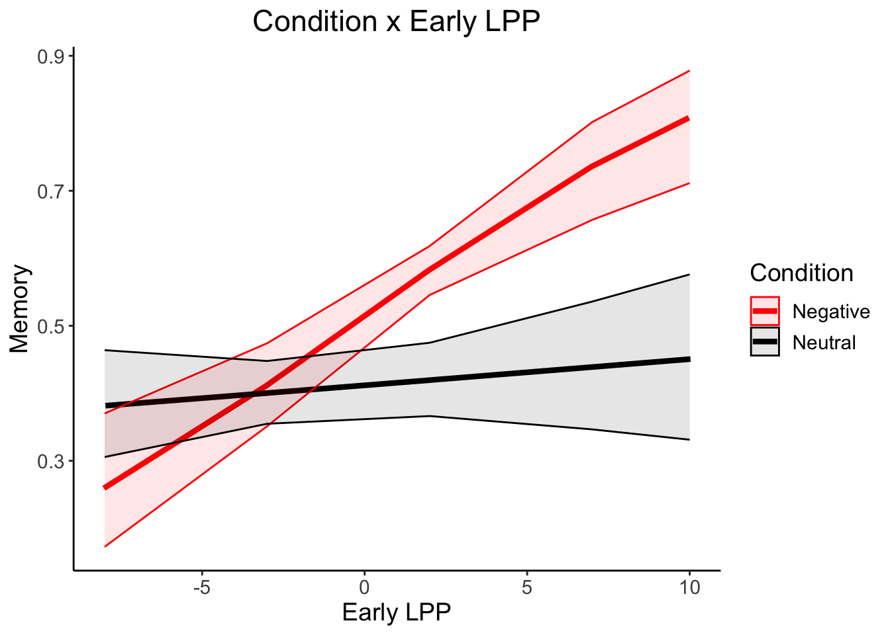{#fig-7}

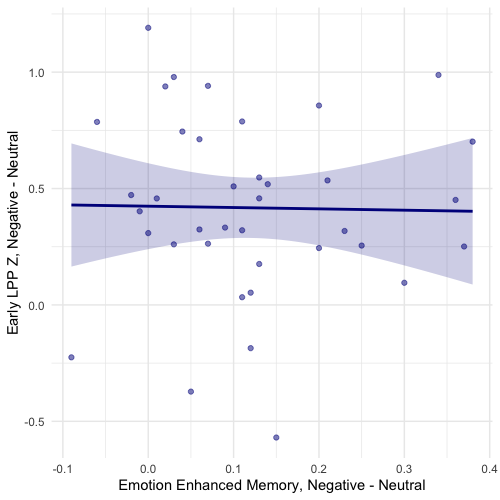{#fig-8}

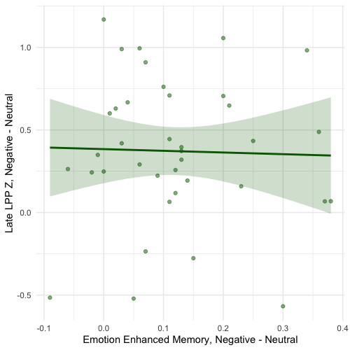{#fig-9}

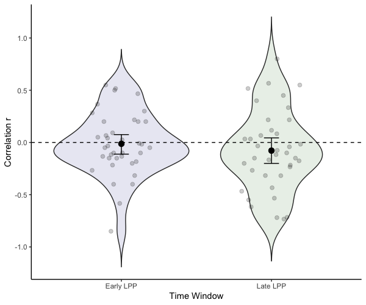{#fig-10}

### eCMR Model Comparison

@tbl-comparison summarizes the four-model comparison.
We first tested whether eCMR's emotional context layer and encoding-strength modulation improve prediction over CMR's temporal-context baseline.
eCMR achieved strictly lower negative log-likelihood (NLL) than CMR for 89.5% of participants.
By AIC, this advantage was reliable, with mean $\Delta$AIC (CMR $-$ eCMR) = 4.06 [1.36, 6.77] and the CI excluding zero.
Bayesian model selection assigned CMR an exceedance probability of .009 and an expected frequency of .175 (@tbl-comparison), confirming that the dual-context mechanism captures meaningful structure in emotional recall beyond temporal dynamics alone.

We next asked whether the LPP alone can account for emotional memory effects.
CMR+LPP achieved lower NLL than CMR for 65.8% of participants, but this improvement did not offset the AIC penalty for the additional parameter: mean $\Delta$AIC (CMR $-$ CMR+LPP) = 0.33 [$-0.77$, 1.44], with the CI including zero.
BMS assigned CMR+LPP an expected frequency of .089 and an exceedance probability below .001 (@tbl-comparison).
The LPP carries some information about which items will be recalled, but too little per subject for one additional parameter to clear the AIC bar.

The critical comparison pits the LPP against category labels at equal parameter cost ($k = 10$).
eCMR achieved lower NLL than CMR+LPP for 68.4% of participants.
Mean $\Delta$AIC (CMR+LPP $-$ eCMR) = 3.73 [1.23, 6.22] and the CI excludes zero; the median $\Delta$AIC = 1.52 [0.18, 2.86] also excludes zero.
At equal parameter cost, category labels embedded in the emotional context architecture captured substantially more variance than trial-level LPP operating through the temporal pathway.

Turning to the LPP constraint, LPP-eCMR achieved strictly lower NLL than eCMR for 73.7% of participants, with the remainder tied after nesting flooring.
By aggregate AIC weights, LPP-eCMR was strongly favored ($w$ = .997 vs .003; @tbl-comparison), and Bayesian model selection also favored LPP-eCMR (exceedance probability = .721 vs .269).

This aggregate advantage was not uniform across individuals.
The mean per-subject $\Delta$AIC (eCMR $-$ LPP-eCMR) was 0.30 [$-0.70$, 1.29], consistent with practical equivalence, and the median was $-1.21$ [$-2.36$, $-0.06$], indicating that the typical participant's NLL improvement did not offset the penalty for the additional parameter.
Protected exceedance probabilities confirmed this heterogeneity, remaining at chance (.250 each).
Together, these results indicate that a subset of participants benefit substantially from the LPP term — enough to dominate the aggregate — while for the remainder the LPP adds little beyond what category labels already capture.

In sum, the emotional context architecture is essential (CMR $<$ eCMR), the LPP cannot replace it (CMR+LPP $\approx$ CMR $\ll$ eCMR), and supplementing category labels with the LPP yields a genuine aggregate fit advantage concentrated among participants for whom the LPP carries the most information about subsequent recall.

| Model    | $k$ | Mean NLL ($\pm$ SE) |   AIC$w$    | BMS $r$ | BMS XP |
|:---------|:---:|:-------------------:|:-----------:|:-------:|:------:|
| CMR      |  9  | 215.01 $\pm$ 15.63  | $\approx$ 0 |  .175   |  .009  |
| CMR+LPP  | 10  | 213.84 $\pm$ 15.73  | $\approx$ 0 |  .089   | <.001  |
| eCMR     | 10  | 211.98 $\pm$ 16.31  |    .003     |  .328   |  .269  |
| LPP-eCMR | 11  | 210.83 $\pm$ 16.46  |    .997     |  .407   |  .721  |

: Model comparison summary. $k$ = free parameters; NLL = negative log-likelihood (mean $\pm$ SE across 38 participants); AIC$w$ = aggregate AIC weight; BMS $r$ = expected model frequency; BMS XP = exceedance probability. {#tbl-comparison}

We assessed qualitative adequacy with two benchmark diagnostics (@fig-catspc; @fig-lpp-recall).
The first targets the emotional enhancement of memory established in the Behavioural Results.
Category-specific serial position curves (@fig-catspc) show that CMR, which lacks an emotional context layer, predicts nearly identical recall for negative and neutral items.
CMR+LPP produces a faint separation because LPP amplitude correlates weakly with emotional category, but the effect is far weaker than what the emotional context architecture achieves.
Both eCMR and LPP-eCMR reproduce the empirical separation: their shared emotional context ensures that negative items promote one another's recall, lifting the negative SPC above the neutral baseline.

A second diagnostic targets the LPP–recall link established in the EEG Results.
Despite aggregate AIC indistinguishability between eCMR and LPP-eCMR, the models make qualitatively different predictions about an untrained summary statistic.
Empirically, recalled emotional items had higher Early LPP amplitudes than unrecalled emotional items; no such difference existed for neutral items, consistent with the GLMM.
eCMR cannot reproduce this pattern: it assigns identical encoding strength to all emotional items regardless of their LPP amplitude, so simulated LPP distributions for recalled and unrecalled emotional items overlap.
Both CMR+LPP and LPP-eCMR reproduce the separation, since both use LPP to modulate encoding strength.
Higher LPP leads to stronger encoding and higher recall probability (@fig-lpp-recall).
The critical difference is that only LPP-eCMR also captures the category-level recall structure visible in the SPC diagnostic.
This outcome reflects genuine generalization since the models are fit to set likelihood, not to the recalled-versus-unrecalled LPP statistic.
LPP-eCMR captures a mechanistic link (LPP $\rightarrow$ encoding strength $\rightarrow$ recall probability) that produces the observed neural-behavioral association as a consequence of its architecture, while also reproducing the categorical emotional memory advantage.

The LPP thus carries real information about emotional encoding strength, as demonstrated by CMR+LPP and LPP-eCMR reproducing the LPP-by-recall pattern that CMR and eCMR cannot.
However, the LPP alone is not a substitute for category labels: it cannot reproduce the categorical recall advantage, and its per-subject signal is small relative to the AIC cost of one parameter.
The value of incorporating trial-level neural measures is not in replacing existing model structure or uniformly improving fit.
It is in characterizing which individuals benefit from the neural constraint and in generating mechanistic predictions that were not used as fitting targets.

::: {#fig-catspc layout-ncol="3"}
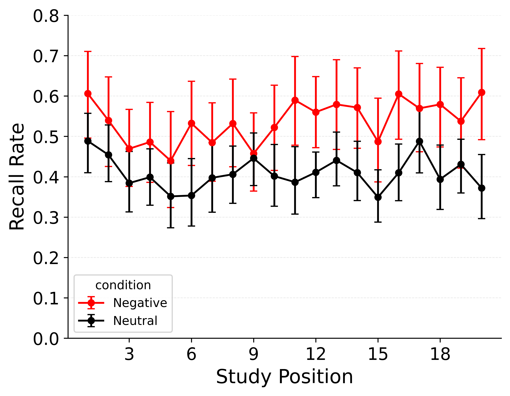

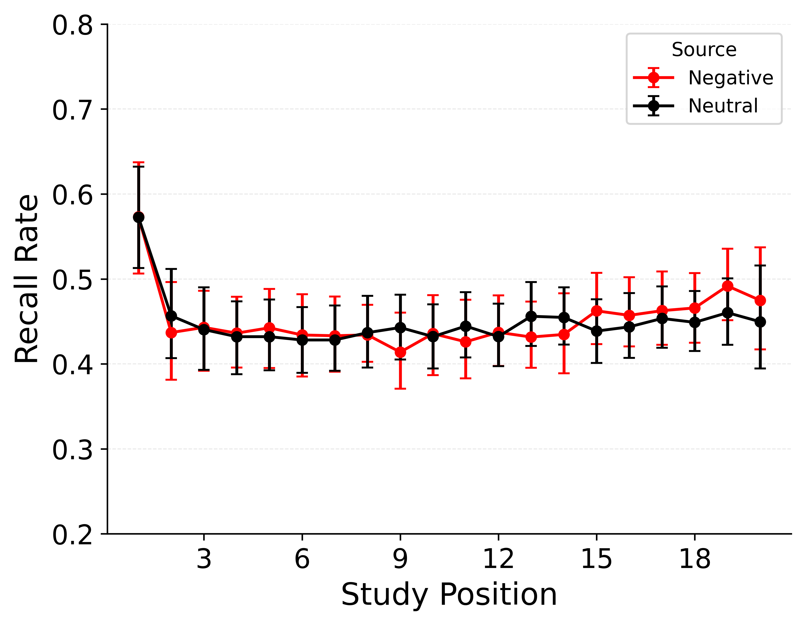

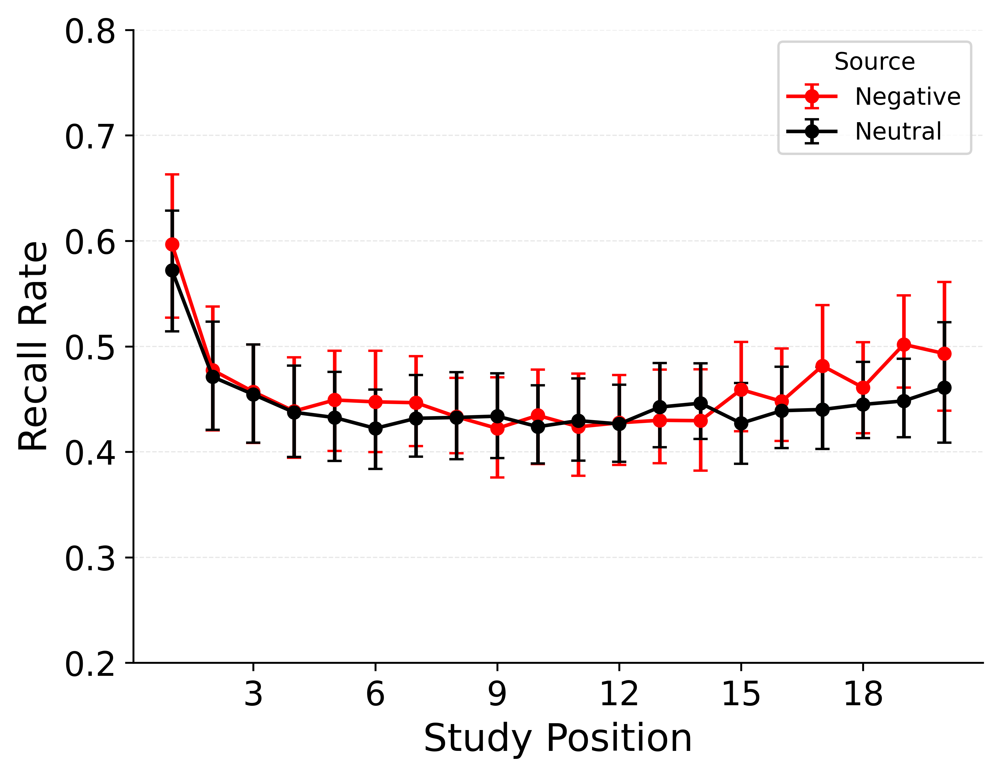

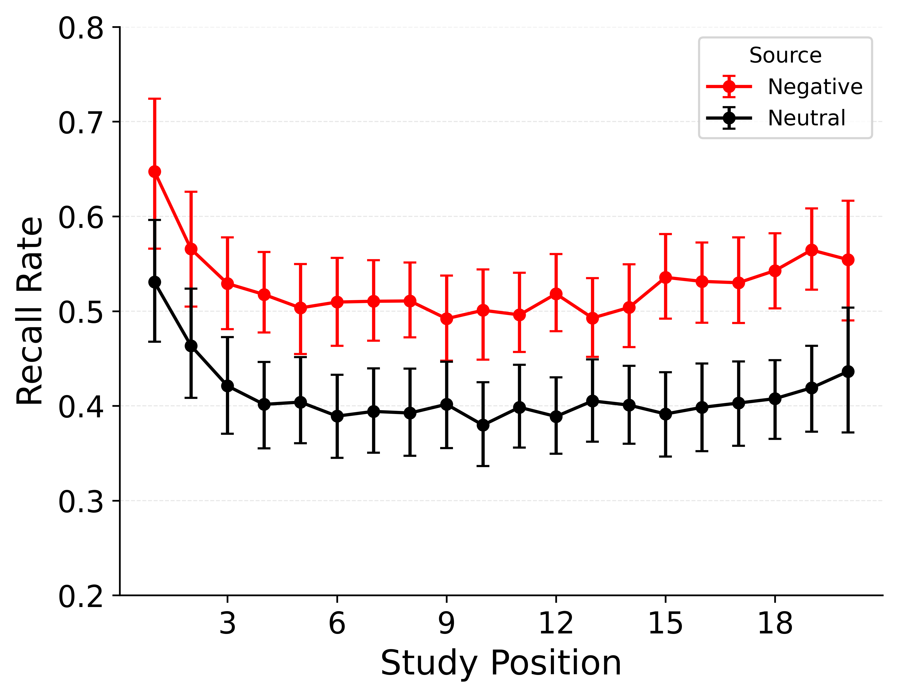

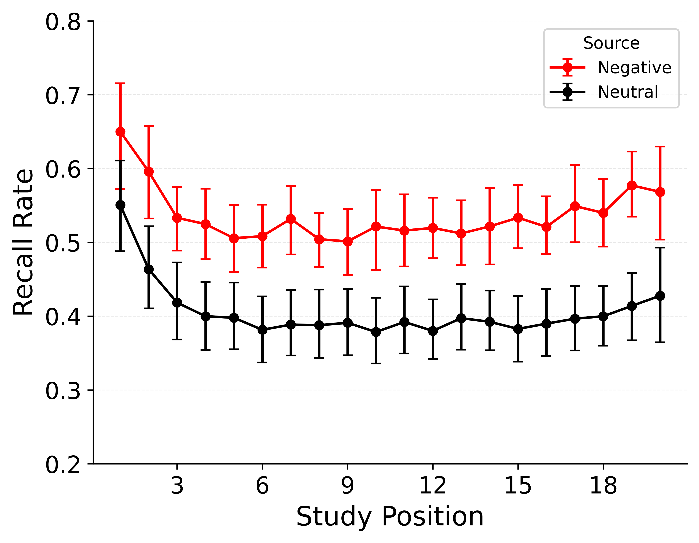

Category-specific serial position curves. Top row: empirical data, CMR, CMR+LPP. Bottom row: eCMR, LPP-eCMR. CMR predicts nearly identical curves; CMR+LPP produces a faint separation via indirect LPP–category correlation; eCMR and LPP-eCMR reproduce the full negative-above-neutral separation.
:::

::: {#fig-lpp-recall layout-ncol="3"}
{height="1.3in"}

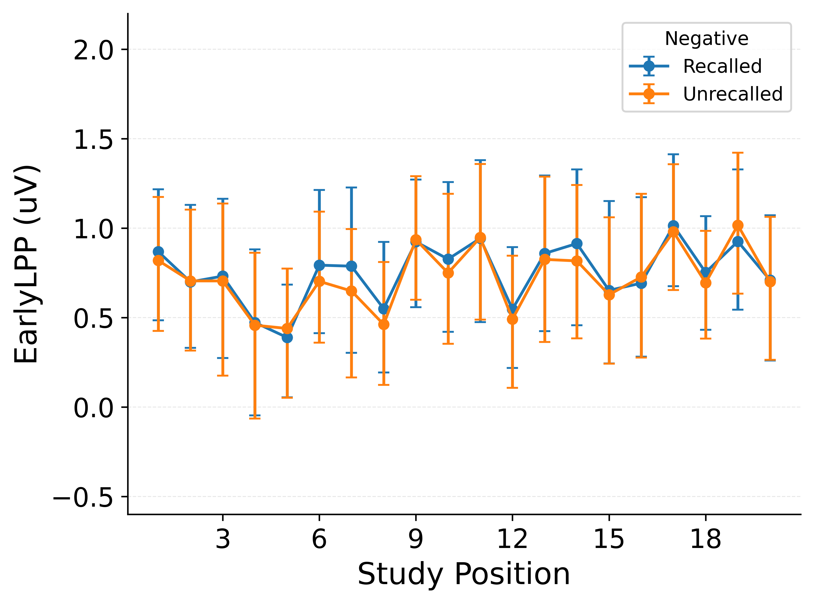{height="1.3in"}

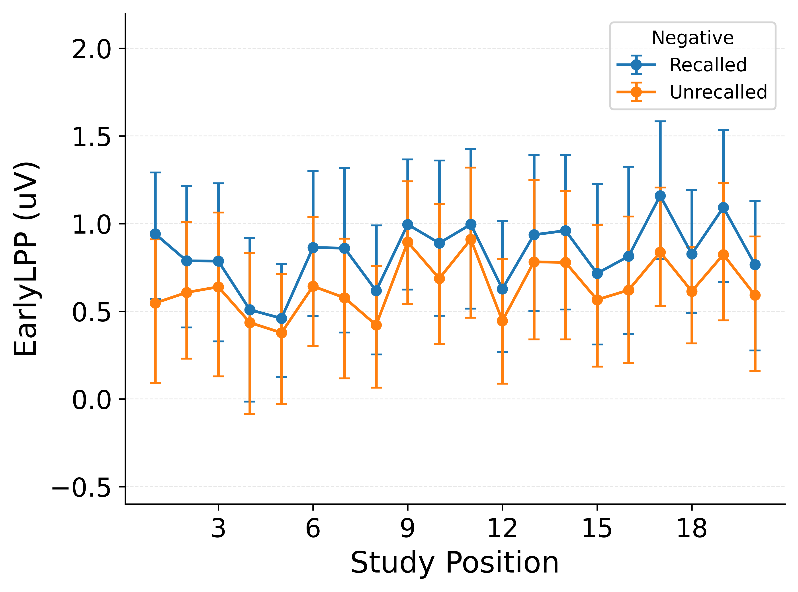{height="1.3in"}

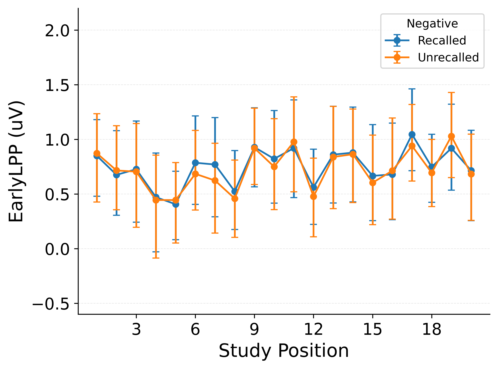{height="1.3in"}

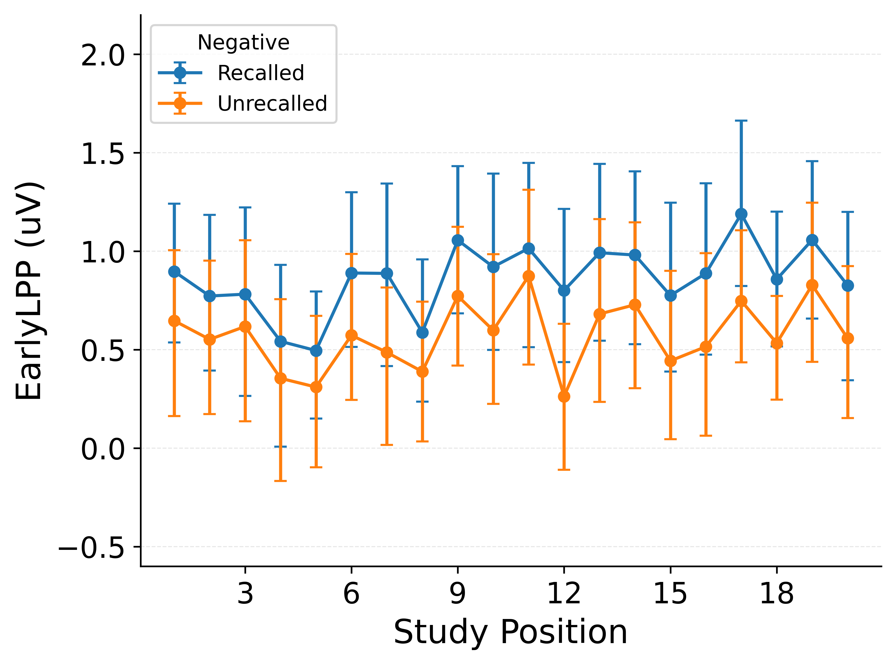{height="1.3in"}

Early LPP amplitude by recall status for negative items. Top row: empirical data, CMR, CMR+LPP. Bottom row: eCMR, LPP-eCMR. CMR+LPP and LPP-eCMR both reproduce the recalled/unrecalled separation; CMR and eCMR cannot.
:::

## Discussion

## References