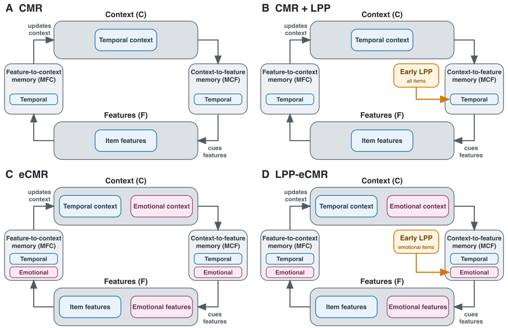

---
format:
  docx:
    reference-doc: reference_landscape.docx
tbl-colwidths: [12, 34, 54]
---

| Model | Information available | Key prediction |
|---|---|---|
| **CMR** | Item identity | No category-level emotional advantage; no LPP-recall relationship |
| **CMR+LPP** | Item identity + trial-level LPP | Only weak indirect category separation; LPP-recall relationship across all items |
| **eCMR** | Item identity + emotional/neutral category | Emotional recall advantage; no item-level LPP-recall relationship |
| **LPP-eCMR** | Category + trial-level LPP | Emotional recall advantage; LPP-recall relationship specific to emotional items |

```{=openxml}
<w:p><w:r><w:br w:type="page"/></w:r></w:p>
```

::: {#fig-model-comparison}

{width=95% fig-alt="Four matched retrieved-context diagrams comparing temporal and emotional representations and Early LPP modulation across CMR, CMR plus LPP, eCMR, and LPP-eCMR."}

Conceptual comparison of the four models. Blue components denote temporal context, item features, and temporal memory pathways; pink components denote emotional context, emotional features, and emotional memory pathways. Early LPP modulates temporal context-to-feature learning for all items in CMR+LPP and emotional context-to-feature learning for emotional items in LPP-eCMR.
:::
